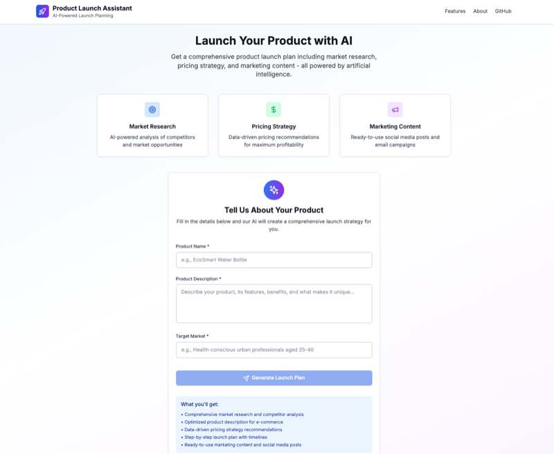
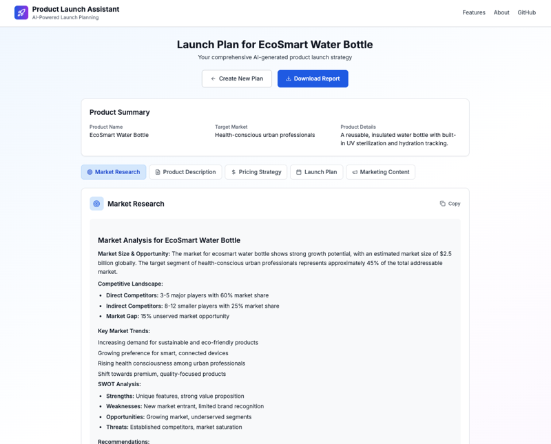

# Product Launch Assistant

[](https://cloud.digitalocean.com/apps/new?repo=https://github.com/digitalocean-labs/product-launch-assistant/tree/main)

A comprehensive AI-powered product launch planning tool that generates market research, pricing strategies, launch plans, and marketing content using advanced AI workflows.

## 📸 **Application Screenshots**

### **Product Input Form**


*Clean, intuitive interface for entering your product details. The form guides you through providing essential information about your product, features, and target market.*

### **AI-Generated Results**


*Comprehensive launch plan with tabbed sections for market research, product descriptions, pricing strategies, launch plans, and marketing content. Each section provides actionable insights tailored to your specific product.*

## 🚀 **Features**

- **🤖 AI-Powered Analysis**: Uses LangGraph workflow with DigitalOcean's Inference API
- **📊 Comprehensive Planning**: Generates 5 key sections for product launch
- **🎨 Modern UI**: Beautiful, responsive React interface with step-by-step workflow
- **📱 Mobile Friendly**: Works seamlessly on desktop and mobile devices
- **🔄 2-Component Architecture**: Scalable frontend/backend separation for DigitalOcean App Platform
- **📋 Export Options**: Download your complete launch plan
- **🔍 Interactive Results**: Tabbed interface with copy-to-clipboard functionality
- **📈 Agent Evaluation**: Built-in quality scoring with LangSmith tracing

## 🎯 **What You Get**

The AI generates a comprehensive launch strategy including:

1. **📈 Market Research**
   - Competitive landscape analysis
   - Market size and opportunities
   - SWOT analysis
   - Key trends and recommendations

2. **📝 Product Description**
   - E-commerce optimized copy
   - Key features and benefits
   - Target audience messaging
   - Compelling value propositions

3. **💰 Pricing Strategy**
   - Multi-tier pricing structure
   - Cost analysis and margins
   - Competitive positioning
   - Revenue projections

4. **🗓️ Launch Plan**
   - Pre-launch, launch, and post-launch phases
   - Week-by-week action items
   - Success metrics and KPIs
   - Risk mitigation strategies

5. **📢 Marketing Content**
   - Social media posts
   - Email campaigns
   - Press release templates
   - Influencer collaboration briefs

## 🏗️**Project Structure**
```
product-launch-assistant/
├── frontend/                   # React application
│   ├── src/
│   │   ├── components/         # UI components
│   │   ├── App.js             # Main app component
│   │   └── index.js           # Entry point
│   ├── screenshots/           # Application screenshots
│   │   ├── form.png          # Product input form
│   │   └── results.png       # Generated results
│   ├── package.json
│   └── Dockerfile            # Frontend container
├── backend/                   # FastAPI application  
│   ├── src/
│   │   ├── main.py           # FastAPI app + endpoints
│   │   ├── workflow.py       # LangGraph workflow (parallelized phases)
│   │   ├── evaluation.py     # Rule-based evaluator + LangSmith logging
│   │   ├── models.py         # Pydantic request/response models
│   │   ├── memory.py         # Logging helpers (no LLM calls)
│   │   ├── search.py         # Web search utilities
│   │   ├── files.py          # File generation helpers
│   │   ├── utils.py          # Validation/sanitization
│   │   ├── config.py         # Config and API keys
│   │   └── quality.py        # Basic text quality heuristics
│   ├── requirements.txt      # Python dependencies
│   └── Dockerfile            # Backend container
├── app.yaml                 # DigitalOcean App Platform config
└── README.md               # This file
```

## 🚀 **Quick Start**

### **Local Development**

1. **Backend Setup**:
   ```bash
   cd backend/

   #create virtual environment
   python -m venv venv

   #use the virtual environment
   source venv/bin/activate

   pip install -r requirements.txt
   
   # Create and configure environment variables
   # Create backend/.env with the following (example):
   cat > .env << 'EOF'
   # Inference/Search
   DIGITALOCEAN_INFERENCE_KEY=your_do_inference_key
   SERPER_API_KEY=your_serper_key

   # LangSmith tracing (observability)
   LANGSMITH_API_KEY=your_langsmith_key
   LANGCHAIN_TRACING_V2=true
   LANGCHAIN_PROJECT=product-launch-assistant
   EOF

   # Start backend
   uvicorn src.main:app --reload --host 0.0.0.0 --port 8000
   ```

2. **Frontend Setup** (new terminal):
   ```bash
   cd frontend/
   npm install
   
   # Create .env file  
   echo "REACT_APP_API_URL=http://localhost:8000" > .env
   
   # Start frontend
   npm start
   ```

3. **Access the application**:
   - **Frontend**: http://localhost:3000
   - **API Docs**: http://localhost:8000/docs
   - **Health Check**: http://localhost:8000/health

## 🚢 **DigitalOcean App Platform Deployment**

### **Manual Setup**

1. **Create App** in DigitalOcean App Platform
2. **Connect Repository** and configure 2 services:

**Backend Service:**
- Name: `backend`
- Source Directory: `/backend`
- Environment: `Python`
- Run Command: `python main.py`
- Port: `8000`
- Routes: `/backend`
- Environment Variables:
  ```
  DIGITALOCEAN_INFERENCE_KEY = [your_key] (SECRET)
  SERPER_API_KEY = [your_serper_key] (SECRET)
  ```

**Frontend Service:**
- Name: `frontend`
- Source Directory: `/frontend`  
- Environment: `Node.js`
- Build Command: `npm run build`
- Run Command: `npx serve -s build -l 3000`
- Port: `3000`
- Routes: `/` (catch-all)
- Environment Variables:
  ```
  REACT_APP_API_URL = [update_with_backend_url_once_deployed]
  If you are deploying using "Deploy with DO" button click, this step is not required.
  ```

3. **Deploy** and your app will be live with 2 independent services!

## 📋 **API Usage**

### **Generate Launch Plan**

**Endpoint**: `POST /backend/launch_assistant` (App Platform) or `POST /launch_assistant` (local)

**Example Request**:
```json
{
  "product_name": "Trendy tote bags with bold designs and Gen Z slogans",
  "product_details": "Trendy tote bags made from eco-friendly materials, featuring bold graphics and Gen Z-inspired slogans. Durable, stylish, and perfect for everyday use.",
  "target_market": "Gen Z teens and young adults who love fashion, self-expression, and pop culture trends."
}
```

**Response Structure**:
```json
{
  "product_name": "Smart Fitness Mirror",
  "product_details": "...",
  "target_market": "...",
  "market_research": "AI-generated market analysis...",
  "product_description": "Compelling e-commerce copy...",
  "pricing_strategy": "Strategic pricing recommendations...",
  "launch_plan": "Step-by-step launch timeline...",
  "marketing_content": "Social media and email content..."
}
```

## 📈 **Agent Evaluation System**

The system includes comprehensive evaluation capabilities to assess AI-generated content quality:

### **Automatic Evaluation**
- **Built-in Scoring**: Every market research output is automatically evaluated
- **Multi-Criteria Assessment**: Content quality, structure, relevance, actionability, completeness, conciseness
- **Weighted Scoring**: Configurable weights for different evaluation criteria
- **Quality Thresholds**: Automatic quality checks with retry logic

### **Manual Evaluation API**
**Endpoint**: `POST /evaluate`

**Example Request**:
```json
{
  "text": "Your text to evaluate...",
  "product_name": "Product Name",
  "target_market": "Target Market",
  "context": "Optional context"
}
```

**Response**:
```json
{
  "total_score": 8.5,
  "content_quality": 9.0,
  "structure_clarity": 8.0,
  "relevance": 8.5,
  "actionability": 8.0,
  "completeness": 9.0,
  "conciseness": 7.5,
  "evaluation_summary": "Total Score: 8.50/10 | Content Quality: 9.0/10 | ..."
}
```

### **Integration with LangSmith**
- **LangSmith Tracing**: Automatic logging of evaluation results for monitoring
- **Dashboard Analytics**: View evaluation trends and model performance
- **Setup**: Ensure `LANGSMITH_API_KEY` and `LANGCHAIN_TRACING_V2=true` are set in `backend/.env`
- **Project name**: `LANGCHAIN_PROJECT=product-launch-assistant`
- **View traces**: `https://smith.langchain.com/`

## 🤖 **AI Model Recommendations**

Based on testing, these models have delivered good results:

- **`llama3.3-70b-instruct`** - Great balance of quality and cost
- **`openai-gpt-4o`** - Best quality, higher cost

Configure in `backend/main.py` by updating the `model` parameter.


## 🔗 **Links**

- **DigitalOcean Inference API**: [Documentation](https://docs.digitalocean.com/products/gradientai/)
- **LangGraph**: [Framework Documentation](https://langchain-ai.github.io/langgraph/) 